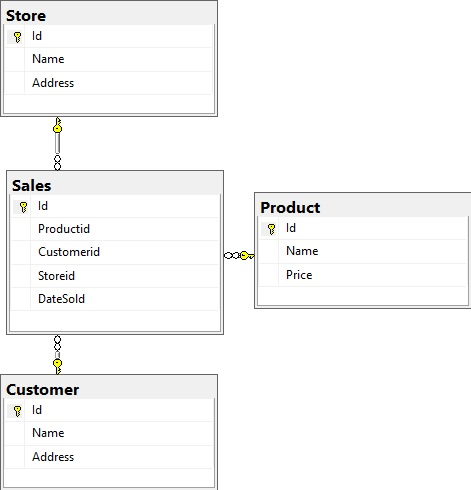

# Talent
This is a MVC Shopping Web application with Visual Studio that connects to a SQL database. Application Front-end is developed with React JS components and used AXIOS to interface with backend and used Semantic-UI-React Elements in views. Models and Controlers are developed using C#. This Shopping web application provides basic CURD operations on Customers,Products,Stores and Sales.  Sales are associated with Customers, Products and Stores.

<H2>DB Design</H2>

